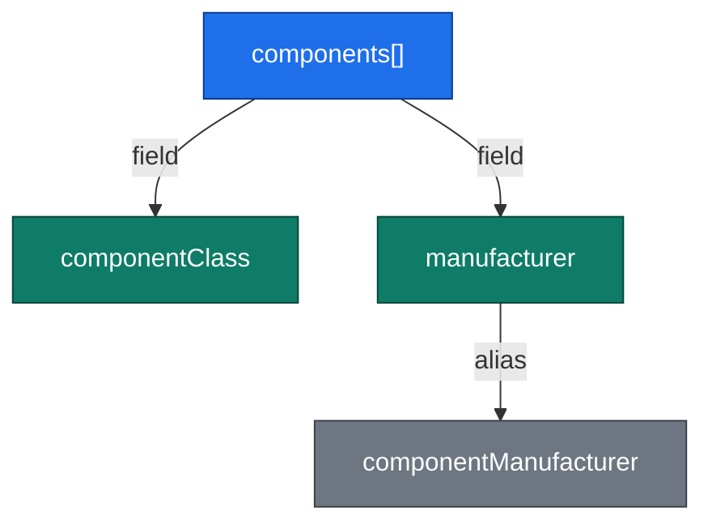

# JSON Model

paccor's JSON model is documented via schema with field groups and a set of ASN.1-backed types that explain how text, numbers, OIDs, byte strings, and trait values are accepted as input. The reference section is a view of that model.

## Field sets

A field set is a group of related JSON fields that describe one logical object. Examples include component identifiers, certificate identifiers, URI references, and the top-level hardware manifest object.

A field set bundles:

- The JSON property name for each field
- Alias names accepted for backward compatibility or alternatives
- Optional ASN.1 values such as OIDs or tag numbers
- A human-readable description derived from project metadata or Javadoc

See the [Field Sets reference](../reference/field-sets.md) for the complete catalogue.

## Vocabularies

Some fields accept a closed set of symbolic values. Those value sets are documented as vocabularies. Each entry records the JSON value, any aliases still accepted, the ASN.1 value it maps to, and a brief description of the meaning of the choice.

See the [Vocabularies reference](../reference/vocabularies.md).

## Global ASN.1 types

Many values are not plain strings in the ASN.1 model even when they look simple in JSON. paccor accepts multiple JSON formats for types such as `ASN1Integer`, `ASN1ObjectIdentifier`, `ASN1OctetString`, `ASN1BitString`, `ASN1UTF8String`, and `AlgorithmIdentifier`. The generated type table shows which shapes are accepted and when wrapper objects or arrays are valid.

See [Global ASN.1 Types](../reference/global-asn1-types.md).

## Diagrams

Each field-set and vocabulary page includes a generated diagram. These diagrams are intended to provide a fast visual answer to questions such as “which aliases still exist for this field?” or “which field owns this vocabulary?” They are not a replacement for the tables; they are a quick orientation aid before you drop into the exact mapping.

