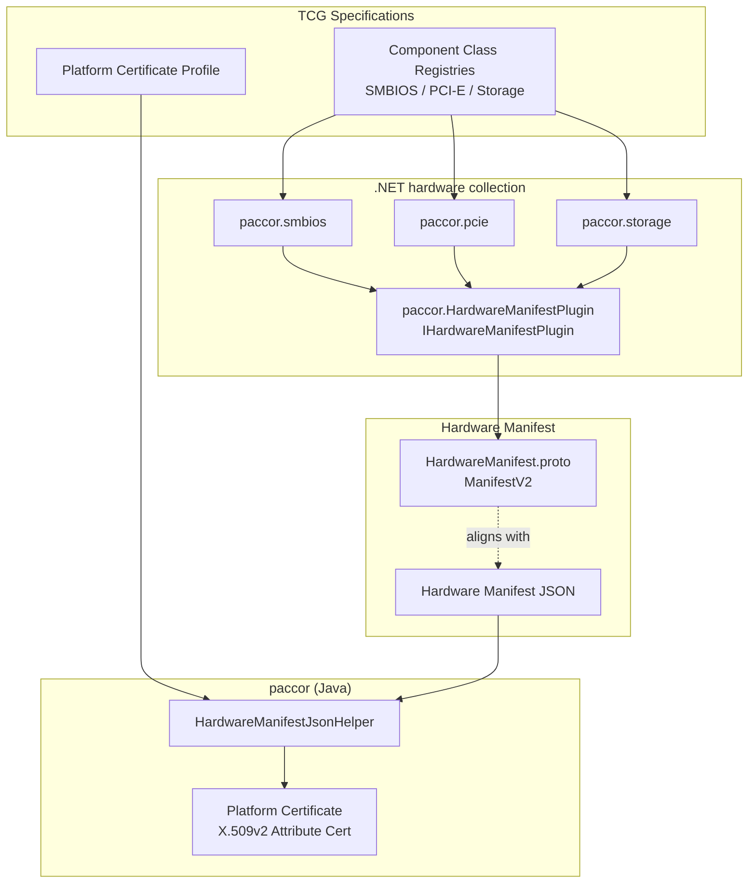

# Pipeline

paccor sits at the certificate-generation end of a hardware evidence pipeline. Upstream tools gather platform facts and serialize them as JSON using `HardwareManifest.proto`. paccor reads that JSON, merges it with attribute and extension details, constructs the to-be-signed certificate body, and then hands that body to an assembly command that can sign using a local key, a PKCS#11 token, a remote signer, or that can make use of a detached signature.

## Overview

## .NET ComponentClassRegistry libraries

The .NET solutions under `dotnet/ComponentClassRegistry/` gather hardware evidence from specific sources and serialize the results into the common manifest. That separation matters because it keeps the collection logic close to the platform APIs while keeping certificate construction in one place.

| NuGet package | TCG Component Class Registry |
| --- | --- |
| [`paccor.smbios`](https://www.nuget.org/packages/paccor.smbios) | [SMBIOS](https://trustedcomputinggroup.org/resource/smbios-based-component-class-registry/) |
| [`paccor.pcie`](https://www.nuget.org/packages/paccor.pcie) | [PCI-E](https://trustedcomputinggroup.org/resource/pcie-based-component-class-registry/) |
| [`paccor.storage`](https://www.nuget.org/packages/paccor.storage) | [Storage](https://trustedcomputinggroup.org/resource/storage-component-class-registry/) |

Each CLI (`SmbiosCli`, `PcieCli`, `StorageCli`) can print `ManifestV2` JSON directly. paccor then consumes that JSON through `HardwareManifestJsonHelper` without requiring a custom importer for each collector.

## HardwareManifest.proto

The `.proto` definition at `dotnet/HardwareManifestPlugin/HardwareManifestPlugin/Resources/HardwareManifest.proto` defines the `ManifestV2` payload shape. paccor's [Hardware Manifest Fields](../reference/_generated/fields/hardware-manifest-fields.md) reference documents the corresponding JSON model, including aliases and case-insensitive input handling.

See the [HardwareManifest Proto](../reference/hardware-manifest-proto.md) reference page for the side-by-side mapping.

## HIRS Provisioner integration

The [HIRS .NET Provisioner](https://github.com/nsacyber/hirs/) is the best concrete example of the plugin contract in use. paccor's `IHardwareManifestPlugin` implementation gathers hardware identifiers, produces `ManifestV2` data, and hands that data to the next stage in the trust pipeline. paccor is then responsible for turning that manifest into a signed credential and, optionally, validating that credential against the expected platform state.
