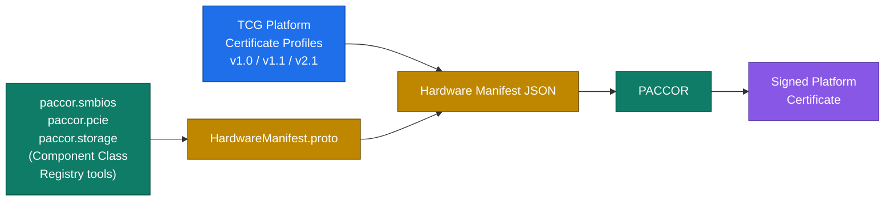

---
hide:
  - navigation
---

# paccor

Create, sign, inspect, and validate TCG Platform Certificates from documented JSON inputs.

paccor is built around the TCG Platform Certificate specifications and supports the v2.1, v1.1, and v1.0 families, including both attribute-certificate and public-key-certificate flows where the profile allows them.

__By default, paccor will generate a v1.1 Platform Attribute Certificate__. You can generate learn how to target a different version [here](tutorials/change-target-version.md). Follow the tutorials to learn how to select between Attribute Certificate and Public Key Certificate.

The docs are organized around one practical question: how do you get from hardware facts and policy JSON to a certificate you can inspect and trust?

## Start Here

-   :material-rocket-launch: __Run the golden path__

    ---

    Start with `pc_certgen` to see the whole system work end to end on one machine.

    [:octicons-arrow-right-24: Getting Started](getting-started.md)

-   :material-file-certificate: __Pick a certificate flow__

    ---

    Use the profile tutorials when you already know the spec family or need a reproducible command sequence.

    [:octicons-arrow-right-24: Certificate Flows](tutorials/paccor/index.md)

-   :material-key-chain-variant: __Pick a signing strategy__

    ---

    Choose between local keys, PKCS#11, remote signing, and detached signatures.

    [:octicons-arrow-right-24: Signing Algorithms](reference/signing-algorithms.md)

-   :material-console-line: __Read the exact CLI__

    ---

    Use the command reference and generated Picocli help when you need precise options and behavior.

    [:octicons-arrow-right-24: CLI Commands](reference/cli-commands.md)

## What You Can Do

-   :material-chart-timeline-variant: __Follow the pipeline__

    ---

    Understand how manifests, policy, extensions, signing, and validation fit together.

    [:octicons-arrow-right-24: Pipeline](concepts/pipeline.md)

-   :material-translate: __Map JSON to ASN.1__

    ---

    Compare field names, aliases, OIDs, and generated schema-backed references.

    [:octicons-arrow-right-24: Field Sets](reference/field-sets.md)

-   :material-microsoft-windows: __Collect hardware data__

    ---

    Feed `ManifestV2` JSON from the .NET collection libraries directly into paccor.

    [:octicons-arrow-right-24: Collect with .NET](tutorials/collect-with-dotnet.md)

-   :material-shield-check-outline: __Validate and inspect output__

    ---

    See representative `validate` and `view` output before you wire paccor into a larger flow.

    [:octicons-arrow-right-24: Output Snapshots](reference/output-snapshots.md)

## The pipeline

## Why this site is structured this way

The generated reference pages are backed by ASN.1 notation and code-level metadata so they stay close to the implementation. The curated pages are there to make the implementation easier to use: a first-run path, profile-specific walkthroughs, signing choices, and compact output examples.

## Status

paccor is maintained by [NSA Cybersecurity Directorate](https://github.com/nsacyber). Downloadable distributions are published on the [GitHub releases](https://github.com/nsacyber/paccor/releases) page.

The original v1.1 user guide remains available as a [PDF reference](_assets/platformCertificateCreator.pdf). The MkDocs site complements that guide with generated schema reference pages, profile-oriented tutorials, and implementation notes tied directly to the current codebase.
